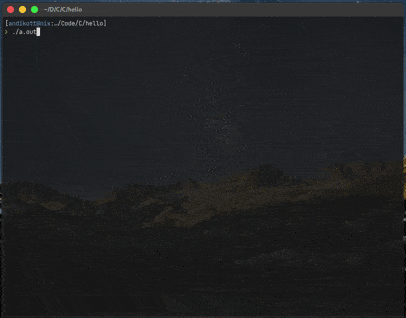

# H
very coolest game i've ever made.

## How to run:
    git clone https://github.com/andynolife/h-moving.git
    cd h-moving
    # this nix-shell if you using nix
    # nix-shell
    gcc h.c -o h -lncurses
    ./h
## Controls
<kbd>Up &#8593;</kbd>
<kbd>Down &#8595;</kbd>
<kbd>Left &#8592;</kbd>
<kbd>Right &#8594;</kbd>
<kbd>q</kbd>
### Give a star if you liked <3
 

